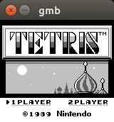

# gmb
---





---
A heavily WIP GameBoy emulator written in C++14.

### Status

 - [x] Show boot sequence
 - [ ] Debugger
 - [x] Hotswapping the CPU
 - [ ] Different mappers
 - [ ] Audio
 - [ ] Video
 - [ ] Interrupts
 - [ ] ...

### Dependencies

  * SDL2
  * libdl (\*nix only for now)
  * [tup](http://gittup.org/tup/) for building
  * A BIOS and a ROM if you actually want to use it

### Building

	tup

### Debugger

The currently implemented commands (subject to change):

 - `n`: Execute the next instruction.
 - `co`: Execute commands until a breakpoint is encountered.
 - `pc`: Print CPU registers.
 - `pd 0xnnnn`: Print instruction mnemonic at `0xnnnn`.
 - `pm 0xnnnn`: Print memory at `0xnnnn`.
 - `pt 0xnnn`: Print tile `0xnnn` (0, ..., 383).
 - `b 0xnnnn`: Add breakpoint.
 - `w 0xnnnn`: Add watchpoint.
 - `pb`: Print breakpoints.
 - `pw`: Print watchpoints.
 - `cb`: Clear breakpoints.
 - `cw`: Clear watchpoints.
 - `dt`: Dump tiles to `tiles.bin`.
 - `q`: Quit.
 - `h`: Help.

### License

```
ISC License

Copyright (c) 2017, Jeremias Yehdegho

Permission to use, copy, modify, and/or distribute this software for any
purpose with or without fee is hereby granted, provided that the above
copyright notice and this permission notice appear in all copies.

THE SOFTWARE IS PROVIDED "AS IS" AND THE AUTHOR DISCLAIMS ALL WARRANTIES WITH
REGARD TO THIS SOFTWARE INCLUDING ALL IMPLIED WARRANTIES OF MERCHANTABILITY
AND FITNESS. IN NO EVENT SHALL THE AUTHOR BE LIABLE FOR ANY SPECIAL, DIRECT,
INDIRECT, OR CONSEQUENTIAL DAMAGES OR ANY DAMAGES WHATSOEVER RESULTING FROM
LOSS OF USE, DATA OR PROFITS, WHETHER IN AN ACTION OF CONTRACT, NEGLIGENCE
OR OTHER TORTIOUS ACTION, ARISING OUT OF OR IN CONNECTION WITH THE USE OR
PERFORMANCE OF THIS SOFTWARE.
```
